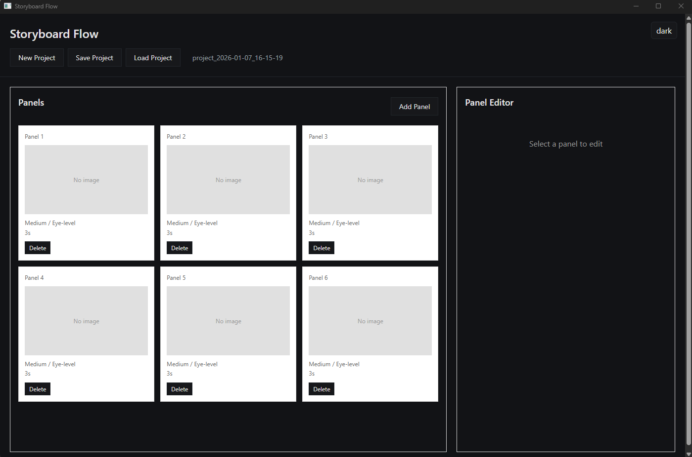

# Storyboard Flow

A desktop application for creating storyboards - visual translations of screenplays into sequential panels with metadata for shot planning and animatic generation.

## Overview

Storyboard Flow helps filmmakers, animators, and visual storytellers transform scripts into visual sequences. Built with Go (backend) and WebView2 (frontend), it provides a streamlined workflow from script import to animatic export.

## Screenshot



## Key Features (TODO)

- **Sequential Panel Canvas**: Organize shots in a visual timeline
- **Rich Metadata**: Track camera angles, movement, dialogue, and timing for each panel
- **Asset Management**: Maintain character model sheets and concept art libraries
- **Script Integration**: Import `.fountain` and `.fdx` screenplay formats
- **Animatic Export**: Generate timed video previews with audio sync
- **Multi-format Output**: Export to PDF, video (MP4/MOV), or EDL/XML for post-production

## Tech Stack

- **Backend**: Go
- **Frontend**: WebView2 (HTML/CSS/JavaScript)
- **Target Platform**: Windows (WebView2), with potential for cross-platform support

## Getting Started

```bash
# Run the application
go run main.go
```

## Project Status

Currently in early development with a working WebView2 demo showcasing Go and JavaScript communication.

## License

AGPL-3.0-or-later
